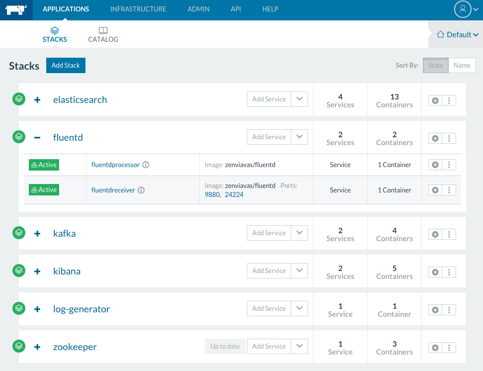
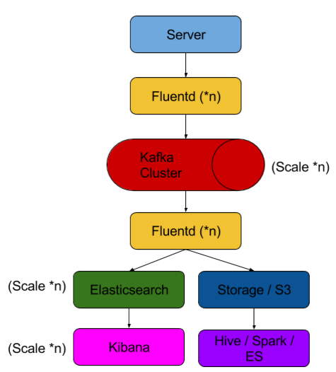

Building an EFK log platform with Docker
========================================

[Tiago Oliveira](http://github.com/tiagodeoliveira)

Software Architect - [Zenvia](http://zenvia.com)

---

# The problem

--

* 200+ GB logs / day
* Used by many teams
  * On troubleshooting, flow validations, metrics, alerts...
* [ELK](https://www.elastic.co/videos/introduction-to-the-elk-stack) not performing well:
  * Redis not clustered, queues easily getting full
  * Elasticsearch:
    * Vertical scaled, reaching the roof
    * Poor index usage
    * Poor cluster usage
  * [Logstash](https://www.elastic.co/products/logstash) using too many resources (I/O operations)

--

* Some applications with standalone logs
* Hard to query among the data
* Hard to log debug/verbose information
* Huge lag on log processing
* Cannot trust the logs

---

# The proposed solution

--

### Create a more reliable, scalable, performatic, reactive ... platform
*Reactive: smartly scale up/down accordingly what is need right at the moment*

--

### EFK

Elasticsearch - Fluentd - Kibana

* Fluentd: written in cRuby, core functions (I/O) written in C;
* Kafka
  * High throughput
  * More scalable
  * Batch producer/consumer
  * Backpressure
  * Persisted

---

# Docker to scale

--

The entire stack is made to be scalable, we need a platform that allows it on a matter of seconds

If we want to react to events, like loading/backpressure/out of resources... we need to do that fast

We need to use all the computacional resources, computacional density

Log is not our core business, we cannot afford dummy fails, it need to be secure (immutable)

---

# Rancher to manage

--

"*Rancher is open source software that makes it simple for organizations to deploy a private container service and deliver Docker orchestration to users. Within a team, authorized users are able to create resource pools from any hosts, and then launch containers or application templates from Rancher’s UI or CLI. Users have complete control over how their applications are deployed, and Rancher provides all of the necessary infrastructure services such as networking, load balancing, and storage to ensure the application runs brilliantly on any infrastructure.*" - http://rancher.com/rancher/

--

* Resource Management
  * All the monitors you need to manage your cluster, metrics can be exported to Graphite as well.
* Container Networking
  * Private network across hosts, IPsec tunneling
* Service discovery
  * DNS-based service discovery (new on Docker 1.10)
* Embedded Container Load Balancing
* Health checks & recovery
* Upgrade
* Store Management

---

# How it looks like

--

--

---

# How to react?

--

## #TODO

* Statsd + Graphite + Influxdb
* Graphite beacon?
* Zabbix?
* Rancher?

What matters is that now things got a lot easier!!

---

### Links

https://github.com/zenvia/fluent-plugin-kafka

https://blog.docker.com/2016/01/docker-1-10-rc/

https://github.com/tiagodeoliveira/reactive-logging-platform

---

### Thanks for the audience
[@_oliveira_tiago](https://twitter.com/_oliveira_tiago)

[https://github.com/tiagodeoliveira](https://github.com/tiagodeoliveira)

[tiagodeoliveira.github.io](tiagodeoliveira.github.io)
